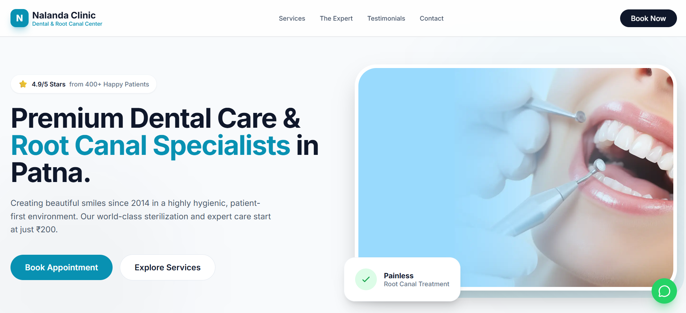
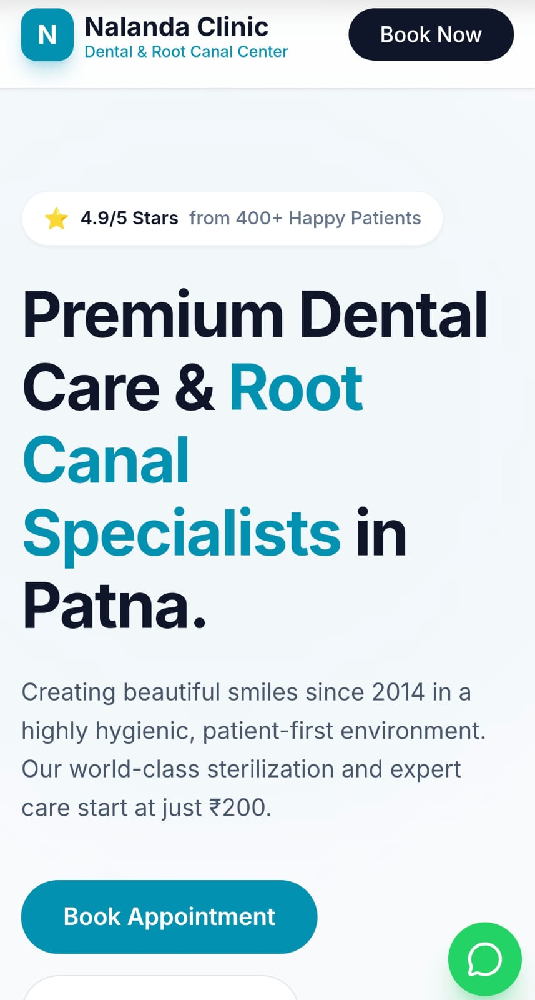

# 🦷 Nalanda Dental Clinic - Premium Landing Page

A modern, high-performance dental clinic website built for **Dr. Praveen Prasad (BDS)** in Khajpura, Patna. This project is designed to convert local search traffic into clinic appointments through a seamless, mobile-first user experience.

---

## 📸 Project Preview

| Desktop View | Mobile Responsive |
| :---: | :---: |
|  |  |

---

## 🚀 Key Features
* **Modern UI/UX:** Clean, hygienic medical aesthetic using a "Deep Navy & Clinical Cyan" palette.
* **Performance:** Optimized with **Vite** for near-instant load times.
* **Interactive Elements:** Smooth scroll animations powered by **Framer Motion**.
* **Conversion Ready:** * Functional Appointment Booking Modal.
    * One-tap WhatsApp integration for instant patient inquiries.
* **Fully Responsive:** Pixel-perfect layout across all devices (Mobile, Tablet, Desktop).

## 🛠️ Tech Stack
* **Core:** React.js (Vite)
* **Styling:** Tailwind CSS
* **Animations:** Framer Motion
* **Icons:** Lucide React
* **Deployment:** Vercel

## 📂 Project Structure
```text
artifacts/nalanda-dental/
├── src/
│   ├── components/    # Reusable UI sections (Hero, Services, Expert, etc.)
│   ├── App.jsx        # Main application logic
│   └── main.jsx       # Entry point
├── public/            # Static assets
└── vite.config.ts     # Build configuration
